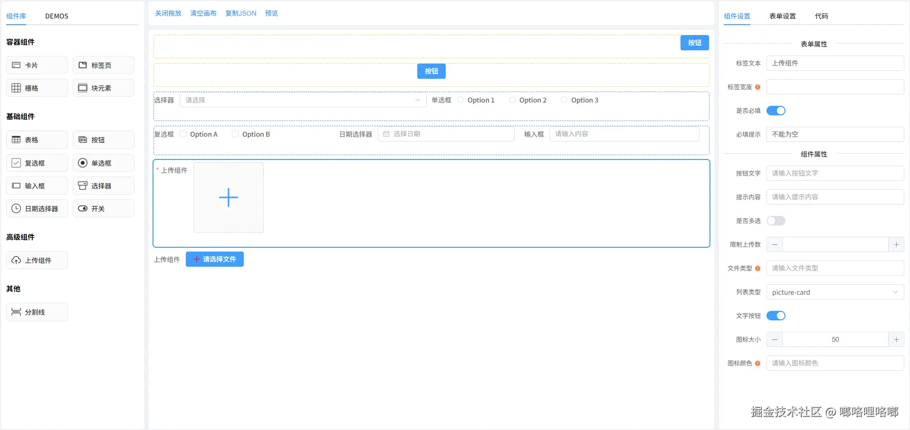

# Vue3 低代码表单设计器



## DEMO
> https://github.com/SpanManX/low-code-form-demo

## 安装依赖
> npm i low-code-form-generator

## 使用
> import lowCodeForm from "low-code-form-generator";
>
> import 'low-code-form-generator/dist/low-code-form-generator.css'

## 项目目录结构
```
src/
├── assets
│     └── svg（存放SVG文件）
│     └── templates （存放模板文件）
│       └── components（vue 模板组件）
│
├── components （vue 组件）
│
├── demo
│
├── store （跨文件数据共享）
│
├── utils （存放封装的函数）
│
└── view （存放vue文件）
```
